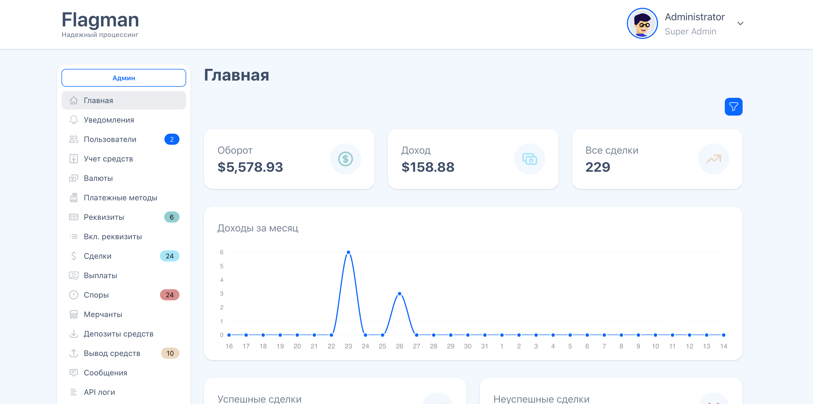
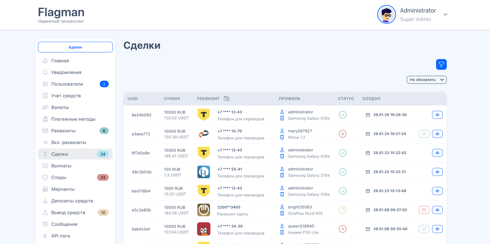

## P2P Processing Platform

Платформа P2P-процессинга для приёма/выплат фиатных платежей, которая соединяет **мерчантов** и **трейдеров** и выполняет расчёты/учёт вознаграждений в **USDT**.

### Стек

- **Backend**: Laravel 11, PHP 8.3
- **Frontend**: Vue 3 (Composition API / Setup), InertiaJS, Vite
- **UI**: Tailwind CSS + DaisyUI
- **Хранилища/очереди**: MySQL 8, Redis, Laravel Horizon
- **Наблюдаемость**: Laravel Telescope, Laravel Pulse, Sentry

### Требования

- **PHP**: 8.3+ (расширения: `bcmath`, `gmp`, `mbstring`)
- **Composer**
- **Node.js**: 18+ (рекомендуется) и npm
- **MySQL**: 8+
- **Redis**: 6+

[Мобильное приложение для автоматики](https://github.com/niiikkid/p2p-app)

[Криптопроцессинг](https://github.com/niiikkid/payment.system)

